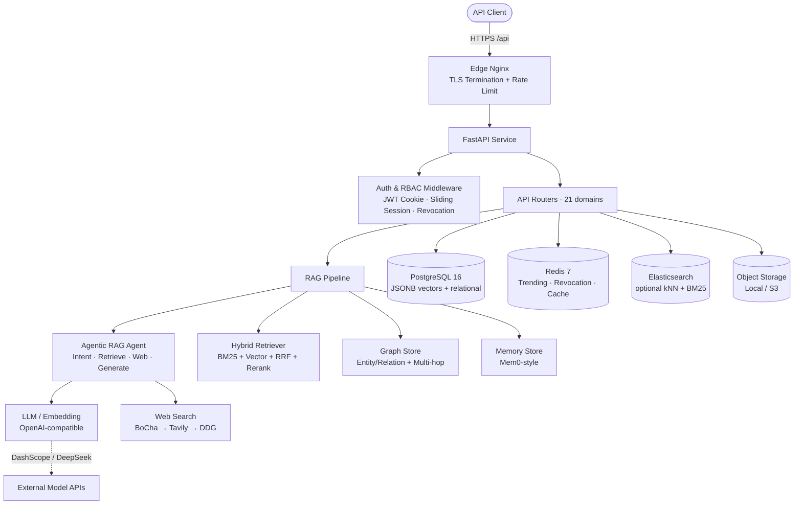

# 知海 Knoa · 后端服务 (Backend Service)

> 面向企业打造的 **检索增强生成（RAG）知识库后端**。基于企业自有知识库与联网检索做增强问答，答案带溯源引用，并具备多轮会话、长期记忆、知识图谱推理与多模态理解能力。本说明仅覆盖后端服务，不含任何前端实现细节。

知海 Knoa 后端是一个异步、可水平扩展的 FastAPI 服务，将大模型（LLM / Embedding）、向量检索、关键词检索、知识图谱、长期记忆与严格的基于角色的访问控制（RBAC）整合为一套**领域无关**的统一问答与知识管理 API。系统面向企业的知识沉淀、检索与智能问答场景，可接入任意行业的私有知识库，为组织提供可溯源、可审计、可治理的 AI 问答能力。

---

## 目录

- [核心特性](#核心特性)
- [系统架构](#系统架构)
- [技术栈](#技术栈)
- [核心设计](#核心设计)
  - [检索增强生成（RAG）管线](#检索增强生成rag管线)
  - [Agentic RAG 决策闭环](#agentic-rag-决策闭环)
  - [知识图谱 Graph RAG](#知识图谱-graph-rag)
  - [长期记忆（Mem0 风格）](#长期记忆mem0-风格)
  - [大模型接入层](#大模型接入层)
  - [联网搜索](#联网搜索)
  - [文档解析与对象存储](#文档解析与对象存储)
  - [语音合成（TTS）](#语音合成tts)
  - [认证与权限（RBAC）](#认证与权限rbac)
  - [限流与安全](#限流与安全)
- [数据模型](#数据模型)
- [API 概览](#api-概览)
- [配置](#配置)
- [部署](#部署)
- [可观测性与运维](#可观测性与运维)
- [覆盖的业务场景](#覆盖的业务场景)
- [仓库结构](#仓库结构)

---

## 核心特性

- **溯源问答（Grounded QA）**：每条回答内联引用角标 `[1][2]`，命中片段与出处文档可追溯、可审计。
- **混合检索**：BM25 关键词检索（jieba 中文分词）与向量稠密检索（numpy 余弦）经 RRF 融合，再由交叉编码器重排，兼顾语义与字面匹配。
- **Agentic RAG**：LangGraph 风格的纯标准库状态机，LLM 自主决定「检索 / 补充检索 / 联网搜索 / 直接回答」，内置防死循环与步数上限保证终止。
- **知识图谱推理**：入库时 LLM 抽取实体与关系，检索支持 1 跳关联召回与多跳 BFS 推理链，处理「A 与 B 的关系 / 影响」类复杂问题。
- **长期记忆**：Mem0 风格的按用户长期记忆，自动抽取偏好 / 事实 / 反馈，后续问答注入系统提示实现个性化。
- **联网实时信息**：可插拔联网搜索（BoCha → Tavily → DuckDuckGo 自动降级），覆盖汇率、股价、天气、最新政策等时效性问答。
- **多模态理解**：用户上传产品图 / 截图经视觉大模型做 OCR 与理解，与文本一并参与问答。
- **企业级权限**：细粒度 RBAC（8 项权限）+ 知识库级隔离（view / edit / admin），内置角色不可删、绑定用户的角色不可删。
- **安全加固**：手写 JWT（HttpOnly Cookie + 滑动续期 + Redis 吊销黑名单）、登录限流与防时序攻击、PBKDF2 密码哈希、SSRF 防护。
- **可观测性**：进程内指标（P50 / P95 / P99）、结构化日志（request_id 链路追踪）、可选 LangSmith 追踪、业务操作审计日志。

---

## 系统架构



**设计原则**

- **最小依赖、无重型云 SDK**：AWS SigV4、腾讯云 TC3、阿里云 OSS 签名、JWT 均手写实现，不引入 boto3 / tencentcloud-sdk / aliyun-sdk / PyJWT / langchain / neo4j 等重型依赖，降低供应链与部署风险。
- **向量不依赖 pgvector**：向量以 JSONB 浮点数组存储，检索用 numpy 余弦计算。切换嵌入维度无需改表迁移，仅需在摄入时按维度一致性过滤。
- **优雅降级优先**：Elasticsearch、联网搜索、重排器、TTS、图谱抽取任一不可用，均降级到可用路径而非整体失败。
- **异步优先**：全链路基于 `asyncio` + `asyncpg`，SSE 流式输出问答，长耗时后台任务（记忆抽取 / 会话摘要 / 图谱抽取）异步执行不阻塞响应。

---

## 技术栈

| 层 | 技术 |
| --- | --- |
| Web 框架 | FastAPI（异步），SSE 经 `sse-starlette` |
| 数据库 | PostgreSQL 16（asyncpg 驱动），向量存于 JSONB |
| 缓存 / 计数 | Redis 7（趋势计数、令牌吊销、缓存） |
| ORM | SQLAlchemy 2.0 `asyncio` + Alembic 迁移 |
| 检索 | `rank-bm25`（BM25）、`jieba`（中文分词）、numpy（余弦）、可选 Elasticsearch（kNN + ik 中文分词） |
| 大模型 | OpenAI 兼容接口（`openai` SDK 封装），默认 DeepSeek 对话 / 阿里云百炼 text-embedding-v4 嵌入 |
| 文档解析 | 标准库 `zipfile` + `xml`（docx）、`pypdf`（pdf，可选） |
| 可观测 | 进程内指标、`logging` 结构化、`langsmith`（可选追踪） |
| 部署 | Docker（`python:3.12-slim` + uv）、Docker Compose、nginx 边缘 TLS |
| 测试 | pytest + pytest-asyncio，PostgreSQL 服务容器 |

---

## 核心设计

### 检索增强生成（RAG）管线

RAG 管线由以下组件构成（`app/core/rag/`）：

- **`chunker.py`**：`MarkdownChunker` 按标题层级切分，滑动窗口 + 噪声过滤（短文本地板），整篇有内容时保底至少 1 块。
- **`embeddings.py`**：`EmbeddingModel` 封装 OpenAI 兼容 embeddings 接口，批量嵌入并显式锁定输出维度（`dimensions` 参数），默认 1024 维。
- **`retriever.py`**：`HybridRetriever` 融合 BM25（jieba 分词）与向量余弦检索，经 RRF（`RRF_K=60`）融合，过滤维度不匹配的片段，再交 `Reranker` 重排。
- **`reranker.py`**：`Reranker` 默认交叉编码器语义重排，加载失败自动降级为「语义 + BM25 + 重叠度」加权打分。
- **`es_retriever.py`**：`ESRetriever` 提供 dense_vector kNN 余弦 + `ik_smart` BM25 + RRF；Elasticsearch 不可用时返回空，自动回退 `HybridRetriever`。
- **`ingestor.py`**：`DocumentIngester` 幂等摄入（先清旧 chunk / ES / 图再重切重嵌），确定性 `_id` 便于增量更新。

### Agentic RAG 决策闭环

`app/core/rag/agent.py` 实现一个 **LangGraph 风格的纯标准库状态机**（不依赖 `langgraph` 库）：

- **节点**为函数（`_n_route` / `_n_retrieve` / `_n_supplement` / `_n_web_search` / `_n_generate` / `_n_finish` / `_n_start_skip`），节点写回 `_AgentState.next` 驱动流转，终态为 `__end__`。
- **意图分类**：LLM 输出 `greeting | web_search | simple | complex`，失败降级为正则启发式；`complex` 意图触发图谱多跳推理。
- **快速预分类**：纯时间 / 数学 / 翻译走问候快路；天气 / 汇率 / 股价 / 最新政策走联网快路，节省 15–40s 检索开销。
- **防死循环规则**：`direct_answer` 受确定性约束——纯问候 / 数学且从未检索才允许直接答；已检索过强制生成；未检索且非 trivial 强制检索；步数上限 `MAX_STEPS=3` 保证终止。
- **生成终态**：基于全部来源流式生成，支持引用标注、`source_count` 裁剪、图谱推理链注入、简洁模式、自定义人设。
- **异步后台**：记忆抽取与滚动会话摘要经后台任务执行（独立 `AsyncSessionLocal`），不阻塞已返回的 SSE 流。

### 知识图谱 Graph RAG

`app/core/rag/graph.py` 的 `GraphStore` 以 **Postgres 存储图（无 Neo4j）**：

- 入库时用 LLM 抽取实体 / 关系（去重），推理模型走流式补全。
- 检索支持 1 跳关联召回（查询向量 → 种子节点 ≥ 0.55 → 1 跳邻居 → 关联 chunk）与多跳 BFS 推理（返回推理链 + 关联 chunk）。
- 60s TTL 缓存降低重复计算。

### 长期记忆（Mem0 风格）

`app/core/rag/memory.py` 的 `MemoryStore`：

- `extract` 用 LLM 抽取偏好 / 事实 / 反馈（失败返回空，不阻断主流程）。
- `retrieve` 按用户余弦相似度召回，`save` 按相似度阈值做 upsert，避免记忆冗余。

### 大模型接入层

`app/core/llm/`：

- `OpenAICompatProvider` 封装 `AsyncOpenAI`，提供 `stream_chat`（抽取 content、兼容 `reasoning_content` 处理、支持模型覆盖）、`chat`、`tool_call`。
- **不依赖原生 function calling**：以强制 JSON 决策提示词约束 LLM 输出 `action / args / raw_text`，再由 `_extract_json` 解析，规避无原生工具调用能力模型的兼容问题。
- 可选 LangSmith `@traceable` 追踪（导入失败退化为空装饰器）。

### 联网搜索

`app/core/rag/web_search.py` 的 `WebSearcher` 按 **BoCha → Tavily → DuckDuckGo HTML（正则解析）** 优先级链，任一失败自动降级；显式指定 provider 失败时返回空而不再降级。

### 文档解析与对象存储

- `app/core/rag/parsers.py`：`parse_document` 注册表支持 md / txt（零依赖）、docx（`zipfile` + `xml`）、pdf（`pypdf` 可选），含解压炸弹防护。
- `app/core/storage.py`：`ObjectStore` 抽象 + `LocalObjectStore`（默认，含路径穿越防护）+ `S3ObjectStore`（httpx + 手写 AWS SigV4，无 SDK）。
- `app/core/oss.py`：手写 HMAC-SHA1 PostObject policy 签名，附带 SSRF 防护的 URL 归一化。
- `app/core/rag/multimodal.py`：视觉 LLM 解析图片（OCR + 描述）、音频 STT（whisper-1），扩展名白名单管控。

### 语音合成（TTS）

`app/core/tts.py` 的 `text_to_voice` 接入腾讯云 TTS，**手写 TC3-HMAC-SHA256 签名**，按 150 中文字切分；未配置时返回 `503 TTSNotConfigured`。

### 认证与权限（RBAC）

`app/core/security.py` + `app/core/rbac.py`：

- **令牌**：手写 JWT（HS256，无 PyJWT），经 HttpOnly Cookie（`knoa_token`）下发，并回写 `X-Access-Token` 响应头配合滑动会话中间件（剩余有效期 < 30% 自动续签）。
- **吊销**：登出将 `jti` 写入 Redis `knoa:revoked:{jti}`（TTL = 剩余有效期），`get_current_user` 校验黑名单。
- **RBAC 模型**：`roles` + `role_permission` + `users.role_id`；内置角色 `admin / editor / viewer`（`is_builtin` 防删）；权限依赖工厂 `require_permission(perm)`、`require_roles(*roles)`、`require_kb_access(min_level)`。
- **知识库级隔离**：`KBPermission(kb_id, user_id, level)` 实现 view / edit / admin 三级隔离；admin 恒为 admin，遗留开放库默认 view/edit，严格库无权限记录则不可访问。

### 限流与安全

- `app/core/ratelimit.py`：`rate_limit(times, seconds, scope)` 进程内滑动窗口，按 `(scope, user)` 限流，超限 `429 + Retry-After`；nginx 边缘层另有 `limit_req` 挡洪水。
- 登录限流 `login_rate_limit(10, 60)` + `DUMMY_HASH` 恒定时间比较防时序攻击。
- 密码哈希 `PBKDF2-HMAC-SHA256`（`PBKDF2_ITERATIONS=100000`）。
- 生产环境 fail-fast 校验（`validate_production_settings`）：弱密钥、弱口令、空 API Key、嵌入维度不匹配、远程数据库弱口令均阻止启动。

---

## 数据模型

ORM 模型集中于 `app/db/__init__.py`（Base 在 `app/database.py`）。核心表：

| 表 | 说明 |
| --- | --- |
| `KnowledgeBase` | 知识库元数据（名称、图标、标签、类目、排序、待审计数） |
| `Document` | 文档（标题、内容、状态、标签、类目、部门、上传者、scope、解析状态） |
| `DocChunk` | 文档切片（内容、**embedding(JSONB)**、置信度、chunk_index） |
| `ChatSession` / `ChatMessage` | 会话与消息（消息含 citations / sources / attachments 的 JSONB） |
| `User` | 用户（username、password_hash、role_id、preferred_model、tts_enabled、model_prefs(JSONB)） |
| `KBPermission` | 知识库级权限（kb_id, user_id, level） |
| `Role` / `RolePermission` | 角色与权限分配 |
| `Memory` | 长期记忆（user_id、content、embedding(JSONB)、meta_type） |
| `KGNode` / `KGEdge` | 知识图谱节点 / 关系（均为 JSONB 向量存储） |
| `Department` | 部门（parent_id 自引用树形） |
| `DocumentTask` | 文档异步处理任务（状态、进度、步骤、错误） |
| `Trending` / `MessageFeedback` | 高频问题计数 / 消息反馈 |
| `OperationLog` / `Announcement` | 操作审计日志 / 系统公告 |

> 向量方案为 **JSONB 浮点数组 + numpy 余弦**，未使用 pgvector 原生类型。

---

## API 概览

所有接口以 `/api` 为前缀，采用 JSON（SSE 仅用于问答流式输出）。主要域：

| 域 | 代表端点 | 说明 |
| --- | --- | --- |
| 系统 | `GET /health`、`GET /metrics` | 健康检查、进程内指标快照 |
| 认证 | `POST /auth/login`、`POST /auth/logout`、`GET /auth/me`、`GET/PATCH/DELETE /auth/users` | 登录登出、用户管理 |
| 知识库 | `GET/POST /knowledge-bases`、`GET /knowledge-bases/{id}/documents`、`GET /search/docs` | 知识库与文档管理、跨库搜索 |
| 文档处理 | `POST .../documents/{id}/approve|reject|ai-review`、`GET /documents/tasks` | 审核工作流、异步任务 |
| 问答 | `POST /ask`（SSE）、`GET /sources/{chunk_id}`、`POST /feedback` | 流式溯源问答、反馈 |
| 会话 | `GET/POST /sessions`、`GET /sessions/{id}`、`GET /records` | 多轮会话与操作记录 |
| 记忆 | `GET/DELETE /memories` | 按用户隔离的长期记忆 |
| 图谱 | `GET /graph`、`GET /graph/hot-nodes`、`GET /graph/export` | 知识图谱浏览与导出 |
| 组织 | `GET/POST/PATCH/DELETE /departments`、`GET/POST/PUT/DELETE /roles` | 部门树、角色与权限管理 |
| 运营 | `GET /analytics/*`、`GET /operations`、`GET /trending` | 运营看板、操作日志、热门问题 |
| 设置 | `GET/PUT /settings`、`GET/POST /announcements` | 模型与系统偏好、公告 |
| 语音/存储 | `POST /tts`、`POST /oss/sign` | 语音合成、对象存储直传签名 |

> 权限门控：问答需 `AI_QA`、文档上传需 `DOC_UPLOAD`、角色管理需 `SYS_SETTINGS` 等，由 RBAC 依赖工厂统一拦截。

---

## 配置

后端配置完全由环境变量驱动（`app/config.py` 的 `Settings(BaseSettings)`），范本见 `.env.example`：

| 配置项 | 说明 |
| --- | --- |
| `DATABASE_URL` / `REDIS_URL` | PostgreSQL(asyncpg) / Redis 连接串 |
| `LLM_BASE_URL` / `LLM_API_KEY` / `LLM_MODEL` | 对话大模型（OpenAI 兼容，默认 DeepSeek） |
| `EMBEDDING_BASE_URL` / `EMBEDDING_API_KEY` / `EMBEDDING_MODEL` / `EMBEDDING_DIM` | 嵌入模型（默认 text-embedding-v4 / 1024 维） |
| `RAG_TOP_K` / `RAG_CHUNK_SIZE` / `RAG_CHUNK_OVERLAP` / `RAG_CHUNK_MIN_CHARS` / `RRF_K` | 检索与切分参数 |
| `ES_ENABLED` / `ES_URL` | 可选 Elasticsearch 混合检索 |
| `MEMORY_ENABLED` / `MEMORY_SIM_THRESHOLD` / `GRAPH_ENABLED` / `GRAPH_MULTI_HOP_MAX` | 记忆与图谱开关 |
| `RERANKER_ENABLED` / `RERANKER_METHOD` / `INTENT_ENABLED` | 重排器与意图分类开关 |
| `BOCHA_API_KEY` / `TAVILY_API_KEY` | 联网搜索 provider 密钥 |
| `JWT_SECRET` / `JWT_EXPIRE_MINUTES` / `ADMIN_USERNAME` / `ADMIN_PASSWORD` | 鉴权与安全 |
| `OBJECT_STORE` / `OSS_*` / `MINIO_*` | 对象存储（local / S3） |
| `TENCENT_TTS_*` | 腾讯云语音合成 |
| `APP_ENV` / `CORS_ORIGINS` / `LOG_LEVEL` | 运行环境与日志 |

> 生产环境（`APP_ENV=production`）会对上述关键项做 fail-fast 校验，缺失或不合规将阻止服务启动。

---

## 部署

- **镜像**：`backend/Dockerfile` 基于 `python:3.12-slim`，使用 `uv` 安装锁定依赖，非 root 用户运行。
- **编排**：`docker-compose.yml` 编排 `postgres:16` + `redis:7-alpine` + `backend` + 边缘 `edge`(nginx:alpine) + 每日 `backup`(pg_dump)。
  - 后端以**明文 HTTP** 暴露 8000，由边缘 nginx 做 **TLS 终止**与限流；仅 `edge` 对外暴露 80/443。
  - 数据卷：`knoa_pgdata` / `knoa_redisdata` / `knoa_uploads` / `knoa_backups`。
- **开发覆盖**：`docker-compose.dev.yml` 将中间件映射到宿主机端口（5433 / 6380），关闭 edge / backup。
- **备份**：`deploy/backup/pg-backup.sh` 每日 `pg_dump`。
- **数据库初始化**：启动 `lifespan` 优先执行 Alembic `upgrade head`，失败回退 `create_all`，并幂等补列 / 回填 / 种子角色与部门。

---

## 可观测性与运维

- **指标**：`GET /api/metrics`（需登录）返回 `snapshot()`—— uptime、活跃 / 总请求、错误数、各端点 P50 / P95 / P99（路径经 `normalize_path` 把 UUID / 数字归一为 `{id}`）。
- **结构化日志**：`setup_logging()` 幂等初始化，`request_id_var`（取自 `X-Request-ID` 或 uuid）经 filter 注入每条日志，支持跨请求链路追踪。
- **链路追踪**：`openai_compat` 与 `agent` 支持可选 LangSmith `@traceable`（由 `LANGSMITH_TRACING` 开关）。
- **业务审计**：`OperationLog` 记录问答 / 搜索来源，支撑 `/analytics/*` 运营看板与 `/operations` 审计查询。
- **健康检查**：`GET /api/health` 供容器与边缘探测。

---

## 覆盖的业务场景

系统内置一套跨境电商（亚马逊美国站）运营知识作为**开箱示例语料**，覆盖五大业务域、约 70 篇真实政策与运营文档，便于快速体验完整能力；实际生产中可直接替换为任意行业的私有知识库：

- **合规（Compliance）**：CE / FDA / UL / PSE / ASTM 认证要求、类目审核资质、商标与专利侵权排查、标签与警示语规范。
- **广告（Ads）**：ACOS 优化、SP / SB / SD 投放结构、否定词策略、新品冷启动预算、竞品广告分析。
- **物流（Logistics）**：FBA 入库流程、标签与贴标、长期仓储费、FBA vs FBM、海外仓、补货公式与防断货、退货处理。
- **选品（Selection）**：蓝海 / 利基选品、利润核算、供应商 sourcing、竞品与差异化分析、季节品。
- **客服（Service）**：A-to-Z 索赔、差评回复、退款 / 退货争议、买家消息模板、多语言服务、VIP 客户。

**典型能力映射**：

- 合规咨询 / 广告优化 / 物流计算 → RAG 检索 + 引用标注；纯数值计算走问候快路不检索。
- 「A 与 B 的关系 / 影响」类复杂问题 → `complex` 意图触发图谱多跳推理。
- 汇率 / 股价 / 天气 / 最新政策 → 联网搜索启发式直搜（可被用户开关关闭，降级为知识库检索）。
- 产品图 / 截图 → 视觉大模型 OCR 与理解。
- 用户偏好 / 历史反馈 → Mem0 长期记忆个性化注入。

---

## 仓库结构

```
backend/
├── Dockerfile / entrypoint.sh / docker-compose.yml   # 容器化与编排
├── pyproject.toml                                    # 依赖锁定（uv.lock）
├── alembic.ini / migrations/                         # Alembic 迁移
├── app/
│   ├── main.py            # 应用入口：中间件、CORS、lifespan、路由挂载
│   ├── config.py          # 环境变量配置（BaseSettings）
│   ├── database.py        # async 引擎 / session / Base / init_db
│   ├── db/__init__.py     # ORM 模型（集中定义）
│   ├── models/            # Pydantic 请求 / 响应模型
│   ├── routers/           # 21 个 API 路由域
│   ├── core/
│   │   ├── llm/           # 大模型接入（openai_compat）
│   │   ├── rag/           # 检索增强管线（chunker/embeddings/retriever/reranker/agent/pipeline/graph/memory/web_search/parsers/...）
│   │   ├── security.py    # JWT / RBAC / 令牌吊销
│   │   ├── rbac.py        # 权限与内置角色单一真值
│   │   ├── ratelimit.py   # 进程内限流
│   │   ├── storage.py     # 对象存储（local / S3 SigV4）
│   │   ├── tts.py         # 腾讯云 TTS（TC3 手写签名）
│   │   ├── oss.py         # OSS 直传签名（SSRF 防护）
│   │   ├── metrics.py     # 进程内指标
│   │   └── logging_config.py  # 结构化日志 + request_id
│   └── data/              # 种子语料（markdown/）与种子脚本
└── tests/                 # pytest 套件
```
