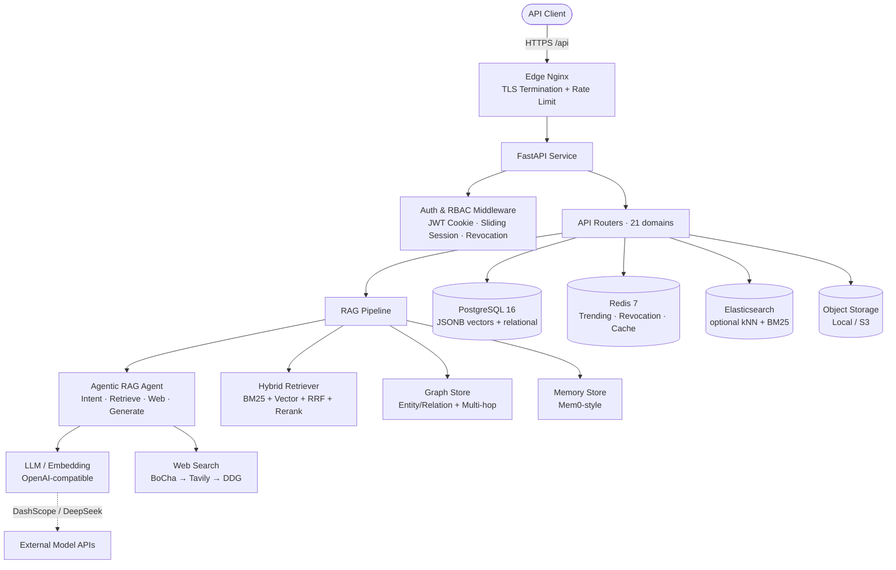

# Zhihai Knoa · Backend Service

> A **Retrieval-Augmented Generation (RAG) knowledge-base backend** for cross-border e-commerce operations teams. It delivers grounded, citation-backed answers over an organization's own knowledge base and live web search, with multi-turn conversations, long-term memory, knowledge-graph reasoning, and multimodal understanding. This document covers the backend service only and intentionally excludes any frontend implementation details.

The Knoa backend is an asynchronous, horizontally-scalable FastAPI service that unifies large language models (LLM / Embedding), vector retrieval, keyword retrieval, a knowledge graph, long-term memory, and fine-grained role-based access control (RBAC) behind a single question-answering and knowledge-management API. It targets real-world cross-border operations on marketplaces such as Amazon.com (US) — compliance, advertising, logistics, product selection, and customer service — giving operators an AI assistant that is traceable, auditable, and governable.

---

## Table of Contents

- [Key Features](#key-features)
- [System Architecture](#system-architecture)
- [Technology Stack](#technology-stack)
- [Core Design](#core-design)
  - [RAG Pipeline](#rag-pipeline)
  - [Agentic RAG Decision Loop](#agentic-rag-decision-loop)
  - [Knowledge Graph (Graph RAG)](#knowledge-graph-graph-rag)
  - [Long-term Memory (Mem0-style)](#long-term-memory-mem0-style)
  - [LLM Integration Layer](#llm-integration-layer)
  - [Web Search](#web-search)
  - [Document Parsing & Object Storage](#document-parsing--object-storage)
  - [Text-to-Speech (TTS)](#text-to-speech-tts)
  - [Authentication & RBAC](#authentication--rbac)
  - [Rate Limiting & Security](#rate-limiting--security)
- [Data Model](#data-model)
- [API Overview](#api-overview)
- [Configuration](#configuration)
- [Deployment](#deployment)
- [Observability & Operations](#observability--operations)
- [Covered Business Scenarios](#covered-business-scenarios)
- [Repository Structure](#repository-structure)

---

## Key Features

- **Grounded QA with Citations**: every answer carries inline citation markers `[1][2]`; the matched chunks and source documents are traceable and auditable.
- **Hybrid Retrieval**: BM25 keyword search (jieba Chinese tokenization) fused with dense vector search (numpy cosine) via Reciprocal Rank Fusion (RRF), then re-ranked by a cross-encoder — combining lexical and semantic signals.
- **Agentic RAG**: a LangGraph-style, pure-stdlib state machine where the LLM decides *retrieve / supplement / web-search / answer-directly*, with built-in anti-infinite-loop guards and a step cap to guarantee termination.
- **Knowledge-Graph Reasoning**: LLM extracts entities/relations at ingest; retrieval supports 1-hop associative recall and multi-hop BFS reasoning chains for relational ("how does A affect B") questions.
- **Long-term Memory**: a Mem0-style per-user memory that auto-extracts preferences / facts / feedback and injects them into the system prompt for personalization.
- **Live Web Information**: pluggable web search (BoCha → Tavily → DuckDuckGo with automatic fallback) covering time-sensitive queries (exchange rates, stock prices, weather, latest policies).
- **Multimodal Understanding**: user-uploaded product images / screenshots are OCR'd and understood by a vision LLM and participate in the answer.
- **Enterprise-grade Authorization**: fine-grained RBAC (8 permissions) plus per-knowledge-base isolation (view / edit / admin); built-in roles and roles bound to users are non-deletable.
- **Hardened Security**: hand-rolled JWT (HttpOnly cookie + sliding refresh + Redis revocation blacklist), login rate limiting with timing-attack resistance, PBKDF2 password hashing, and SSRF protection.
- **Observability**: in-process metrics (P50 / P95 / P99), structured logging with request-id tracing, optional LangSmith tracing, and a business operation audit log.

---

## System Architecture



**Design Principles**

- **Minimal dependencies, no heavyweight cloud SDKs**: AWS SigV4, Tencent Cloud TC3, Aliyun OSS signatures, and JWT are all implemented by hand — no boto3 / tencentcloud-sdk / aliyun-sdk / PyJWT / langchain / neo4j, reducing supply-chain and deployment risk.
- **No pgvector dependency**: vectors are stored as JSONB float arrays and compared with numpy cosine. Switching embedding dimensions requires no schema migration — only a dimension-consistency filter at retrieval time.
- **Graceful degradation first**: if Elasticsearch, web search, the reranker, TTS, or graph extraction is unavailable, the system falls back to a working path instead of failing outright.
- **Async-first**: the entire stack is built on `asyncio` + `asyncpg`; answers stream over SSE, and long-running background tasks (memory extraction / conversation summarization / graph extraction) run asynchronously without blocking the response.

---

## Technology Stack

| Layer | Technology |
| --- | --- |
| Web framework | FastAPI (async), SSE via `sse-starlette` |
| Database | PostgreSQL 16 (asyncpg driver), vectors stored in JSONB |
| Cache / counters | Redis 7 (trending counts, token revocation, caches) |
| ORM | SQLAlchemy 2.0 `asyncio` + Alembic migrations |
| Retrieval | `rank-bm25` (BM25), `jieba` (Chinese tokenization), numpy (cosine), optional Elasticsearch (kNN + ik analyzer) |
| LLM | OpenAI-compatible interface (`openai` SDK wrapper); default DeepSeek chat / Alibaba DashScope text-embedding-v4 embedding |
| Document parsing | stdlib `zipfile` + `xml` (docx), `pypdf` (pdf, optional) |
| Observability | in-process metrics, structured `logging`, LangSmith (optional tracing) |
| Deployment | Docker (`python:3.12-slim` + uv), Docker Compose, nginx edge TLS |
| Testing | pytest + pytest-asyncio with a PostgreSQL service container |

---

## Core Design

### RAG Pipeline

The RAG pipeline lives in `app/core/rag/`:

- **`chunker.py`**: `MarkdownChunker` splits by heading hierarchy with a sliding window and noise filtering (short-text floor), guaranteeing at least one chunk per non-empty document.
- **`embeddings.py`**: `EmbeddingModel` wraps an OpenAI-compatible embeddings endpoint, batches embeddings, and explicitly locks output dimensionality (`dimensions`), defaulting to 1024.
- **`retriever.py`**: `HybridRetriever` fuses BM25 (jieba tokenization) with vector cosine search via RRF (`RRF_K=60`), filters dimension-mismatched chunks, then passes results to `Reranker`.
- **`reranker.py`**: `Reranker` defaults to a cross-encoder semantic rerank; on load failure it degrades to a weighted score of semantic + BM25 + overlap.
- **`es_retriever.py`**: `ESRetriever` provides dense_vector kNN cosine + `ik_smart` BM25 + RRF; when Elasticsearch is unreachable it returns empty and the system automatically falls back to `HybridRetriever`.
- **`ingestor.py`**: `DocumentIngester` ingests idempotently (clears old chunks / ES / graph before re-splitting and re-embedding), with deterministic `_id`s for incremental updates.

### Agentic RAG Decision Loop

`app/core/rag/agent.py` implements a **LangGraph-style, pure-stdlib state machine** (no `langgraph` dependency):

- **Nodes** are functions (`_n_route` / `_n_retrieve` / `_n_supplement` / `_n_web_search` / `_n_generate` / `_n_finish` / `_n_start_skip`); each writes `_AgentState.next` to drive flow, terminating at `__end__`.
- **Intent classification**: the LLM outputs `greeting | web_search | simple | complex`, degrading to regex heuristics on failure; `complex` intent triggers graph multi-hop reasoning.
- **Fast pre-classification**: pure time / math / translation queries take the greeting fast path; weather / exchange-rate / stock / latest-policy queries take the web-search fast path, saving 15–40s of retrieval overhead.
- **Anti-infinite-loop rules**: `direct_answer` is deterministically constrained — only pure greetings / math that have never retrieved may answer directly; once retrieval has happened generation is forced; non-trivial un-retrieved queries are forced to retrieve; a `MAX_STEPS=3` cap guarantees termination.
- **Generation terminal**: streams the answer over all sources, supporting citation markers, `source_count` truncation, graph reasoning-chain injection, concise mode, and a custom persona.
- **Async background work**: memory extraction and rolling conversation summarization run as background tasks (independent `AsyncSessionLocal`) so they never block the already-returned SSE stream.

### Knowledge Graph (Graph RAG)

`app/core/rag/graph.py`'s `GraphStore` keeps the graph in **Postgres (no Neo4j)**:

- At ingest, the LLM extracts entities / relations (deduplicated; reasoning models use streaming completion).
- Retrieval supports 1-hop associative recall (query vector → seed nodes ≥ 0.55 → 1-hop neighbors → related chunks) and multi-hop BFS reasoning (returns a reasoning chain + related chunks).
- A 60s TTL cache reduces repeated computation.

### Long-term Memory (Mem0-style)

`app/core/rag/memory.py`'s `MemoryStore`:

- `extract` uses the LLM to pull preferences / facts / feedback (returns empty on failure, never blocking the main flow).
- `retrieve` recalls by per-user cosine similarity; `save` upserts by a similarity threshold to avoid redundant memories.

### LLM Integration Layer

`app/core/llm/`:

- `OpenAICompatProvider` wraps `AsyncOpenAI`, exposing `stream_chat` (content extraction, `reasoning_content` handling, model override support), `chat`, and `tool_call`.
- **No reliance on native function calling**: a forced-JSON decision prompt constrains the LLM to emit `action / args / raw_text`, parsed by `_extract_json` — avoiding compatibility gaps on models without native tool calling.
- Optional LangSmith `@traceable` tracing (degrades to a no-op decorator if import fails).

### Web Search

`app/core/rag/web_search.py`'s `WebSearcher` uses a **BoCha → Tavily → DuckDuckGo HTML (regex parse)** priority chain with automatic fallback; an explicitly named provider that fails returns empty rather than falling back.

### Document Parsing & Object Storage

- `app/core/rag/parsers.py`: `parse_document` registry supports md / txt (zero-dependency), docx (`zipfile` + `xml`), and pdf (`pypdf`, optional), with zip-bomb protection.
- `app/core/storage.py`: `ObjectStore` abstraction + `LocalObjectStore` (default, with path-traversal protection) + `S3ObjectStore` (httpx + hand-written AWS SigV4, no SDK).
- `app/core/oss.py`: hand-written HMAC-SHA1 PostObject policy signing, with SSRF-safe URL normalization.
- `app/core/rag/multimodal.py`: vision-LLM image parsing (OCR + description), audio STT (whisper-1), with an extension whitelist.

### Text-to-Speech (TTS)

`app/core/tts.py`'s `text_to_voice` integrates Tencent Cloud TTS with a **hand-written TC3-HMAC-SHA256 signature**, splitting on every 150 CJK characters; returns `503 TTSNotConfigured` when unconfigured.

### Authentication & RBAC

`app/core/security.py` + `app/core/rbac.py`:

- **Token**: hand-rolled JWT (HS256, no PyJWT) issued via an HttpOnly cookie (`knoa_token`) and mirrored to the `X-Access-Token` response header, paired with a sliding-session middleware (auto-renew when remaining validity < 30%).
- **Revocation**: logout writes the `jti` to Redis `knoa:revoked:{jti}` (TTL = remaining validity); `get_current_user` checks the blacklist.
- **RBAC model**: `roles` + `role_permission` + `users.role_id`; built-in roles `admin / editor / viewer` (`is_builtin` prevents deletion); permission dependency factories `require_permission(perm)`, `require_roles(*roles)`, `require_kb_access(min_level)`.
- **Per-KB isolation**: `KBPermission(kb_id, user_id, level)` implements view / edit / admin isolation; admin is always admin, legacy open KBs default to view/edit, and strict KBs with no permission record are inaccessible.

### Rate Limiting & Security

- `app/core/ratelimit.py`: `rate_limit(times, seconds, scope)` is an in-process sliding-window limiter keyed by `(scope, user)`, returning `429 + Retry-After`; the nginx edge layer adds `limit_req` to absorb floods.
- Login limiting `login_rate_limit(10, 60)` plus `DUMMY_HASH` constant-time comparison to resist timing attacks.
- Password hashing via `PBKDF2-HMAC-SHA256` (`PBKDF2_ITERATIONS=100000`).
- Production fail-fast validation (`validate_production_settings`): weak secrets, weak passwords, empty API keys, embedding-dimension mismatch, and remote weak database passwords all block startup.

---

## Data Model

ORM models are centralized in `app/db/__init__.py` (Base in `app/database.py`). Core tables:

| Table | Description |
| --- | --- |
| `KnowledgeBase` | KB metadata (name, icon, tags, category, ordering, pending-review count) |
| `Document` | Document (title, content, status, tags, category, department, uploader, scope, parse status) |
| `DocChunk` | Document chunk (content, **embedding (JSONB)**, confidence, chunk_index) |
| `ChatSession` / `ChatMessage` | Conversation and messages (messages carry citations / sources / attachments as JSONB) |
| `User` | User (username, password_hash, role_id, preferred_model, tts_enabled, model_prefs (JSONB)) |
| `KBPermission` | Per-KB permission (kb_id, user_id, level) |
| `Role` / `RolePermission` | Roles and permission assignments |
| `Memory` | Long-term memory (user_id, content, embedding (JSONB), meta_type) |
| `KGNode` / `KGEdge` | Knowledge-graph nodes / relations (JSONB vector storage) |
| `Department` | Department (self-referencing parent_id tree) |
| `DocumentTask` | Async document-processing task (status, progress, step, error) |
| `Trending` / `MessageFeedback` | Trending-question counts / message feedback |
| `OperationLog` / `Announcement` | Operation audit log / system announcements |

> Vectors use **JSONB float arrays + numpy cosine**, not the native pgvector type.

---

## API Overview

All endpoints are prefixed with `/api` and use JSON (SSE is used only for streaming answers). Major domains:

| Domain | Representative endpoints | Description |
| --- | --- | --- |
| System | `GET /health`, `GET /metrics` | Health check, in-process metrics snapshot |
| Auth | `POST /auth/login`, `POST /auth/logout`, `GET /auth/me`, `GET/PATCH/DELETE /auth/users` | Login/logout, user management |
| Knowledge Base | `GET/POST /knowledge-bases`, `GET /knowledge-bases/{id}/documents`, `GET /search/docs` | KB & document management, cross-KB search |
| Document processing | `POST .../documents/{id}/approve\|reject\|ai-review`, `GET /documents/tasks` | Review workflow, async tasks |
| QA | `POST /ask` (SSE), `GET /sources/{chunk_id}`, `POST /feedback` | Streaming cited QA, feedback |
| Sessions | `GET/POST /sessions`, `GET /sessions/{id}`, `GET /records` | Multi-turn sessions and operation records |
| Memory | `GET/DELETE /memories` | Per-user isolated long-term memory |
| Graph | `GET /graph`, `GET /graph/hot-nodes`, `GET /graph/export` | Knowledge-graph browsing and export |
| Organization | `GET/POST/PATCH/DELETE /departments`, `GET/POST/PUT/DELETE /roles` | Department tree, role & permission management |
| Operations | `GET /analytics/*`, `GET /operations`, `GET /trending` | Ops dashboards, audit log, trending questions |
| Settings | `GET/PUT /settings`, `GET/POST /announcements` | Model & system preferences, announcements |
| Voice/Storage | `POST /tts`, `POST /oss/sign` | Text-to-speech, object-storage direct-upload signature |

> Permission gating: QA requires `AI_QA`, document upload requires `DOC_UPLOAD`, role management requires `SYS_SETTINGS`, etc., enforced uniformly by the RBAC dependency factories.

---

## Configuration

Backend configuration is fully environment-driven (`Settings(BaseSettings)` in `app/config.py`); see `.env.example`:

| Setting | Description |
| --- | --- |
| `DATABASE_URL` / `REDIS_URL` | PostgreSQL (asyncpg) / Redis connection strings |
| `LLM_BASE_URL` / `LLM_API_KEY` / `LLM_MODEL` | Chat LLM (OpenAI-compatible, default DeepSeek) |
| `EMBEDDING_BASE_URL` / `EMBEDDING_API_KEY` / `EMBEDDING_MODEL` / `EMBEDDING_DIM` | Embedding model (default text-embedding-v4 / 1024-dim) |
| `RAG_TOP_K` / `RAG_CHUNK_SIZE` / `RAG_CHUNK_OVERLAP` / `RAG_CHUNK_MIN_CHARS` / `RRF_K` | Retrieval and chunking parameters |
| `ES_ENABLED` / `ES_URL` | Optional Elasticsearch hybrid retrieval |
| `MEMORY_ENABLED` / `MEMORY_SIM_THRESHOLD` / `GRAPH_ENABLED` / `GRAPH_MULTI_HOP_MAX` | Memory and graph toggles |
| `RERANKER_ENABLED` / `RERANKER_METHOD` / `INTENT_ENABLED` | Reranker and intent-classification toggles |
| `BOCHA_API_KEY` / `TAVILY_API_KEY` | Web-search provider keys |
| `JWT_SECRET` / `JWT_EXPIRE_MINUTES` / `ADMIN_USERNAME` / `ADMIN_PASSWORD` | Auth and security |
| `OBJECT_STORE` / `OSS_*` / `MINIO_*` | Object storage (local / S3) |
| `TENCENT_TTS_*` | Tencent Cloud text-to-speech |
| `APP_ENV` / `CORS_ORIGINS` / `LOG_LEVEL` | Runtime environment and logging |

> In production (`APP_ENV=production`) the critical settings above are fail-fast validated; missing or non-compliant values block startup.

---

## Deployment

- **Image**: `backend/Dockerfile` is based on `python:3.12-slim`, installs locked dependencies with `uv`, and runs as a non-root user.
- **Orchestration**: `docker-compose.yml` orchestrates `postgres:16` + `redis:7-alpine` + `backend` + edge `edge` (nginx:alpine) + daily `backup` (pg_dump).
  - The backend exposes plain HTTP on 8000; the **edge nginx terminates TLS** and applies rate limiting; only `edge` is exposed on 80/443.
  - Volumes: `knoa_pgdata` / `knoa_redisdata` / `knoa_uploads` / `knoa_backups`.
- **Dev override**: `docker-compose.dev.yml` maps middleware to host ports (5433 / 6380) and disables edge / backup.
- **Backup**: `deploy/backup/pg-backup.sh` runs a daily `pg_dump`.
- **DB initialization**: on startup, `lifespan` runs Alembic `upgrade head` first, falls back to `create_all` on failure, then idempotently adds columns / backfills / seeds roles and departments.

---

## Observability & Operations

- **Metrics**: `GET /api/metrics` (auth required) returns `snapshot()` — uptime, active / total requests, error counts, and per-endpoint P50 / P95 / P99 (paths are normalized via `normalize_path`, replacing UUIDs / numbers with `{id}`).
- **Structured logging**: `setup_logging()` initializes idempotently; `request_id_var` (from `X-Request-ID` or uuid) is injected into every log line via a filter, enabling cross-request traceability.
- **Tracing**: `openai_compat` and `agent` support optional LangSmith `@traceable` (gated by `LANGSMITH_TRACING`).
- **Business audit**: `OperationLog` records QA / search sources, powering the `/analytics/*` dashboards and `/operations` audit queries.
- **Health check**: `GET /api/health` is used by the container and edge for probing.

---

## Covered Business Scenarios

The system is seeded with real cross-border e-commerce (Amazon.com US) operations knowledge across five business domains, with roughly 70 real policy and operations documents:

- **Compliance**: CE / FDA / UL / PSE / ASTM certification requirements, category-approval qualifications, trademark and patent infringement checks, labeling and warning-language standards.
- **Advertising**: ACOS optimization, SP / SB / SD campaign structure, negative-keyword strategy, new-launch cold-start budget, competitor ad analysis.
- **Logistics**: FBA inbound process, labeling, long-term storage fees, FBA vs FBM, overseas warehouses, replenishment formula and stockout prevention, return handling.
- **Product Selection**: blue-ocean / niche selection, profit calculation, supplier sourcing, competitor and differentiation analysis, seasonal products.
- **Customer Service**: A-to-Z claims, negative-review responses, refund / return disputes, buyer-message templates, multilingual service, VIP customers.

**Capability mapping**:

- Compliance咨询 / ad optimization / logistics math → RAG retrieval + citation; pure numeric computation takes the greeting fast path (no retrieval).
- "Relationship / impact between A and B" complex questions → `complex` intent triggers graph multi-hop reasoning.
- Exchange rates / stock prices / weather / latest policies → web-search fast path (can be toggled off by the user, degrading to KB retrieval).
- Product images / screenshots → vision-LLM OCR and understanding.
- User preferences / historical feedback → Mem0 long-term memory personalization injection.

---

## Repository Structure

```
backend/
├── Dockerfile / entrypoint.sh / docker-compose.yml   # Containerization & orchestration
├── pyproject.toml                                    # Locked dependencies (uv.lock)
├── alembic.ini / migrations/                         # Alembic migrations
├── app/
│   ├── main.py            # App entry: middleware, CORS, lifespan, router mounting
│   ├── config.py          # Environment configuration (BaseSettings)
│   ├── database.py        # async engine / session / Base / init_db
│   ├── db/__init__.py     # ORM models (centralized)
│   ├── models/            # Pydantic request / response models
│   ├── routers/           # 21 API route domains
│   ├── core/
│   │   ├── llm/           # LLM integration (openai_compat)
│   │   ├── rag/           # Retrieval-augmented pipeline (chunker/embeddings/retriever/reranker/agent/pipeline/graph/memory/web_search/parsers/...)
│   │   ├── security.py    # JWT / RBAC / token revocation
│   │   ├── rbac.py        # Single source of truth for permissions & built-in roles
│   │   ├── ratelimit.py   # In-process rate limiting
│   │   ├── storage.py     # Object storage (local / S3 SigV4)
│   │   ├── tts.py         # Tencent Cloud TTS (hand-written TC3 signature)
│   │   ├── oss.py         # OSS direct-upload signature (SSRF protection)
│   │   ├── metrics.py     # In-process metrics
│   │   └── logging_config.py  # Structured logging + request_id
│   └── data/              # Seed corpus (markdown/) and seed scripts
└── tests/                 # pytest suite
```
