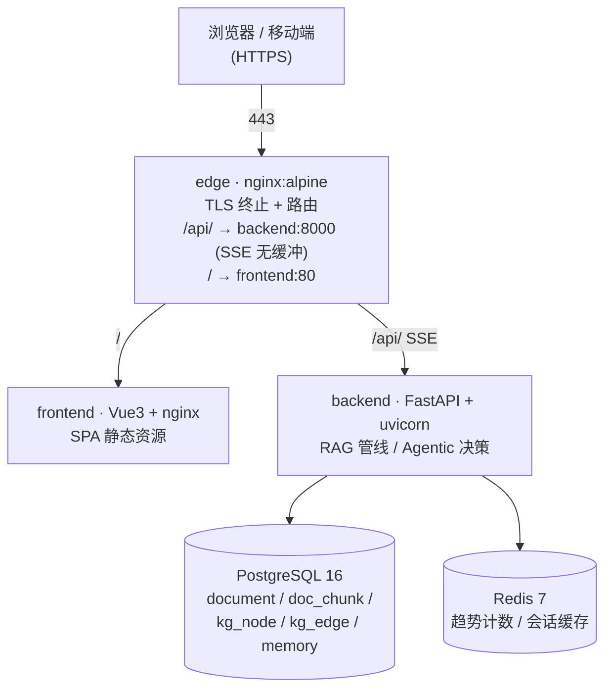
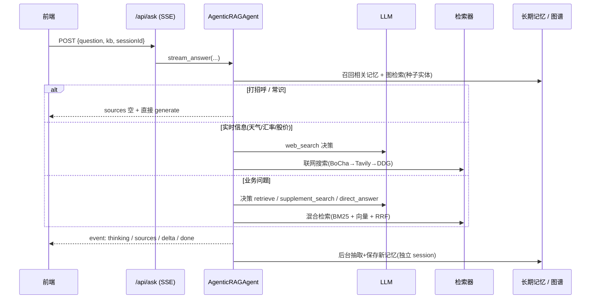

# Knoa 系统架构

> 配套文档：[API 参考](./api.md) · [运维手册](./runbook.md) · [设计规格](../docs/design-spec.md)
> 部署编排见根目录 `docker-compose.yml`（生产 base）+ `docker-compose.dev.yml`（开发覆盖）。

Knoa 是面向电商运营的知识库 RAG 问答系统：自有知识库检索增强生成、答案带**溯源引用**、多会话历史、答案反馈。产品定位与企业级知识库场景见 `docs/design-spec.md`。

---

## 1. 部署拓扑

- **仅 `edge` 对外暴露 80/443**；postgres / redis / backend / frontend 只在容器网络内互通（不发布宿主机端口，见 `docker-compose.yml`）。
- **TLS 在 edge 终止**，backend / frontend 跑明文 HTTP，证书私钥只存在于宿主机 `deploy/nginx/certs/`（绝不进镜像或 git）。
- **本地开发**用 `docker compose -f docker-compose.yml -f docker-compose.dev.yml up`，恢复 pg/redis/frontend 的宿主机端口并关闭 edge/backup（见 `docker-compose.dev.yml`）。

---

## 2. 后端 RAG 管线（Agentic）

问答主流程是 LLM 自主决策的 **Agentic RAG** 循环（不是写死的检索→生成流水线）：

关键组件（`backend/app/core/rag/`）：

| 模块 | 职责 |
| --- | --- |
| `chunker.py` | 文档按固定窗口切分（默认 500 字 / 重叠 50） |
| `embeddings.py` | 调 Embedding API 生成向量（默认 1536 维，以 `EMBEDDING_DIM` 为准） |
| `ingestor.py` | 入库：写 `document` + `doc_chunk`（带向量），可选双写 ES / 建图 |
| `retriever.py` | 混合检索（BM25 关键词 + 向量稠密），RRF 融合取 top-k |
| `agent.py` | **Agentic 决策**：LLM 判断 `retrieve` / `supplement_search` / `web_search` / `direct_answer`；问候跳过；`MAX_STEPS` 熔断保证终止 |
| `pipeline.py` | 问答主流程：检索 → 流式生成 → 注入引用 → 心跳/超时保护 |
| `es_retriever.py` / `es_client.py` | 可选 ES 混合检索（kNN + BM25 + RRF），`ES_ENABLED=True` 且索引存在时启用，否则回退 pgvector |
| `memory.py` | Mem0 轻量自研版：LLM 抽取偏好/事实/反馈，余弦>0.92 去重，按 `user_id` 召回注入 |
| `graph.py` | 知识图谱 Graph RAG：摄入时 LLM 抽实体/关系，问答时向量召回+1 跳扩展（Postgres 存图，无需 Neo4j） |

---

## 3. 技术决策（为什么这样选型）

| 决策 | 选择 | 理由 |
| --- | --- | --- |
| 向量存储 | **JSONB + numpy 余弦**，不用 pgvector 扩展 | 零额外依赖，沙箱/受限环境可直接跑；检索用 numpy 矩阵运算足够快 |
| RAG 框架 | **自研管线**，不用 LangChain | 透明可控、易调、无重依赖；Agentic 决策循环自实现（类 LangGraph 节点图，纯 stdlib） |
| 知识图谱 | **Postgres 表存图**，不用 Neo4j server | 沙箱起不了 Neo4j；检索走确定性向量匹配，LLM 不可达时仍可用 |
| 长期记忆 | **自研 Mem0 轻量版**，复用 JSONB+numpy | 零新依赖；向量冲突消解（>0.92 覆盖） |
| 混合检索 | BM25 + 向量 + **RRF 融合** | 关键词与语义互补，RRF 无需调权即融合 |
| DB 访问 | **SQLAlchemy 2.0 async**（`AsyncSession` + asyncpg） | 全链路异步，SSE 流式不被阻塞 |
| SSE 传输 | **关闭所有层缓冲**（uvicorn / vite proxy / nginx `proxy_buffering off`） | 否则流式回答被攒批后一次性吐出，体验垮掉 |
| 测试替身 | `app.dependency_overrides` 换 LLM/Embedder/Redis | `Depends()` 在路由定义时按对象身份捕获依赖，模块属性重绑无效 |

---

## 4. 数据模型（核心表）

| 表 | 说明 |
| --- | --- |
| `knowledge_base` | 知识库（含 `pending_count` 死列，真实待复核数实时统计） |
| `document` | 文档（标题 / 状态 `已审核`\|`待复核` / 来源知识库） |
| `doc_chunk` | 切片（原文 / 向量 JSONB / 所属文档） |
| `chat_session` / `chat_message` | 多会话历史与消息 |
| `message_feedback` | 答案反馈（赞/踩/复制） |
| `user` / `kb_permission` | RBAC 用户与「库级权限」（admin/editor/viewer） |
| `memory` | 长期记忆（JSONB 向量 + 类别） |
| `kg_node` / `kg_edge` | 知识图谱节点 / 关系 |

> Schema 由 Alembic 管理（`backend/migrations`，初始迁移 `eb70aefd7b19`）。无 Alembic 前的表靠 `init_db()` 的 `create_all` 兜底；**现有表加列需手动 `ALTER`**（见运维手册）。

---

## 5. 请求 / SSE 事件流

- 前端所有请求走**相对路径 `/api/...`**，由 edge 反代到 backend；同源故开发期不触发 CORS。
- `/api/ask` 是 `POST` + `text/event-stream`：因 POST 不能用浏览器 `EventSource`，前端用 `fetch` + `ReadableStream` 手动解析。
- SSE 事件以 **CRLF（`\r\n`）** 分隔（`event: x` / `data: {...}`），前端需 `replace(/\r\n/g,'\n')` 再按 `\n\n` 切分。
- 事件类型：`thinking`（Agent 决策/思考）→ `sources`（命中片段）→ `delta`（逐字）→ `ping`（心跳）→ `done` / `error`。
